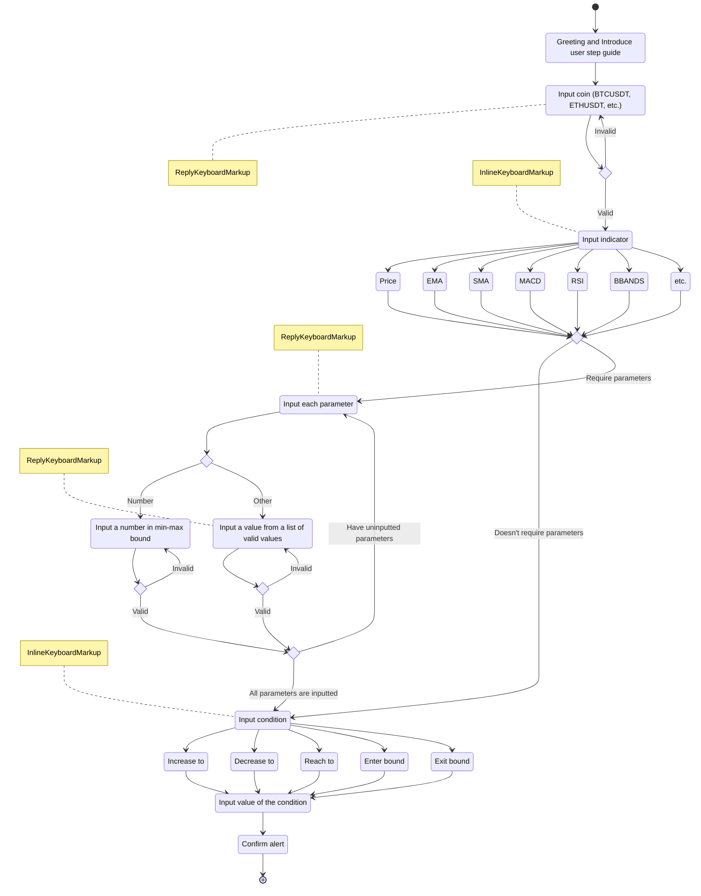

# Cryptocurrencies Alert Bot

## Database

### PostgreSQL

```bash
docker run -e POSTGRES_PASSWORD=postgres -p 5432:5432 -d postgres
```

To migrate

```bash
cd stream/database
alembic revision --autogenerate
alembic upgrade head
```

### Redis

```bash
docker run -p 6379:6379 -d redis
```

## Process Flow Description

### User create a new alert



#### Introduction

This document offers developers a detailed guide on how to implement the process for creating alerts within a chat application. The process, as outlined in the provided Mermaid graph, involves a series of steps that include greeting the user, guiding them through selecting various parameters, and finally confirming the alert creation.

#### Process Flow

##### 1. Greeting and Introduction

Begin by sending a warm greeting message to the user to initiate the interaction. Alongside the greeting, introduce the step-by-step guide for creating an alert to set the user's expectations.

##### 2. Select Coin

In this step, prompt the user to specify the cryptocurrency of interest, which can be done either by typing the coin's name (e.g., BTCUSDT, ETHUSDT) or selecting it from a list of available coins presented through the `ReplyKeyboardMarkup`. Ensure the input is checked for validity. If the user's input does not match any valid coin, guide them to input the coin name again.

##### 3. Select Indicator

Next, direct the user to select an indicator that will be the basis for their alert. Present a list of indicator options using the `InlineKeyboardMarkup`. The choice of indicator may impact the subsequent steps, so keep track of the user's selection.

##### 4. Input Indicator Parameters

If the chosen indicator requires additional parameters, guide the user to input each parameter separately. Handle this process dynamically based on the indicator type:

- If the indicator parameter is a numerical value, request the user to input a number that falls within a specified range (min-max). Offer numeric input suggestions using the `ReplyKeyboardMarkup` to facilitate input accuracy.
- If the indicator parameter is a predefined value (e.g., Open, High, Low, Close), provide the user with a list of valid options through `ReplyKeyboardMarkup` for selection.

##### 5. Select Condition

After gathering the indicator and its parameters (if necessary), ask the user to choose a condition for their alert. Present a list of condition options using the `InlineKeyboardMarkup`. The selected condition will define the criteria for the alert.

##### 6. Input Value for the Condition

Following the selection of a condition, prompt the user to input a value associated with that condition. For example, if the condition is "Increase to," the user should specify the value to which the cryptocurrency should increase.

##### 7. Confirm Alert

Upon collecting all the necessary information, send a confirmation message summarizing the details of the alert, including the selected coin, indicator, parameters (if any), condition, and value. Offer the user the option to confirm or cancel the alert creation.

##### 8. End Process

The process concludes when the user either confirms or cancels the alert. If the user confirms, the alert creation process is completed, and you can return to the initial state to handle additional interactions. If the user cancels, also return to the initial state, allowing them to start over if they wish.

#### Implementation Considerations

During the implementation of this process, developers should consider the following:

- Utilize suitable libraries and tools for building interactive chat applications.
- Implement robust input validation at each stage to ensure user-provided data is accurate and meets the required criteria.
- Maintain a state management system to keep track of the conversation's progress and guide users effectively.
- Handle user interactions with the provided keyboards (ReplyKeyboardMarkup and InlineKeyboardMarkup) and process their responses accordingly.
- Allow users to revisit and modify their selections as needed.
- Implement comprehensive error handling to gracefully manage unexpected inputs or errors, ensuring a smooth user experience.

By adhering to this detailed guide and referencing the provided Mermaid graph, developers can create a user-friendly and seamless process for users to effortlessly create alerts within their chat application.
